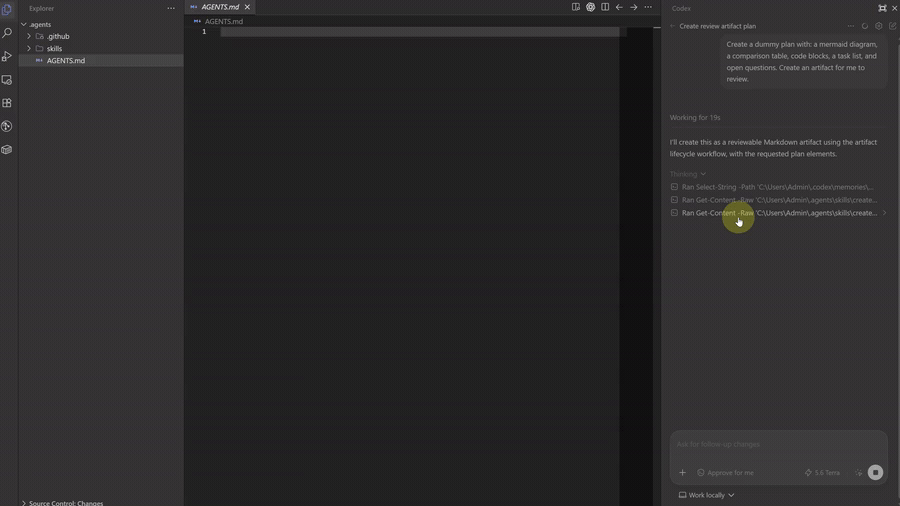
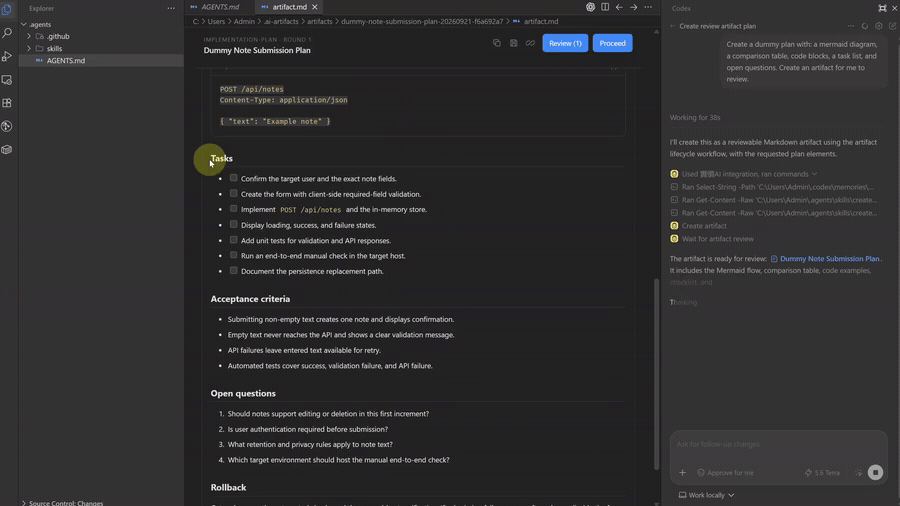
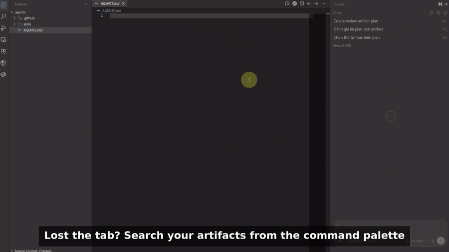

> This project was built through vibe coding with AI.

# AI Artifacts - Interactive Planning & Review

📦 [VS Code Marketplace](https://marketplace.visualstudio.com/items?itemName=huynguyen294.ai-artifacts) · 🌐 [Open VSX](https://open-vsx.org/extension/huynguyen294/ai-artifacts) · 🐙 [GitHub](https://github.com/huynguyen294/ai-artifacts)

**AI Artifacts** lets AI coding agents such as **Cursor**, **Codex**, and **GitHub Copilot** create **dedicated interactive artifacts** directly in your IDE. Use it for implementation plans, design proposals, or technical write-ups. Add inline comments and let your agent revise the document based on your feedback. It connects to your agent through **MCP** and the **create-review-artifact** skill.

## Contents

- [How It Works](#how-it-works)
- [Requirements & compatibility](#requirements--compatibility)
- [Getting started](#getting-started)
- [Verification & troubleshooting](#verification--troubleshooting)
- [Usage](#usage)
- [Storage, behavior and security](#storage-behavior-and-security)
- [Compatibility and upgrades](#compatibility-and-upgrades)
- [Uninstalling and cleanup](#uninstalling-and-cleanup)
- [Development](#development)
- [Documentation](#documentation)

## How It Works

1. **Ask for an artifact** — Ask your AI agent to create a plan or write-up as an artifact. It opens in your IDE for review.
2. **Leave comments** — Select text and add feedback wherever you want changes or clarification.
3. **Choose what happens next:**
   - **Review** — Send your comments to the agent for revision.
   - **Proceed** — Approve the plan and let the agent execute it.
   - **Just save** — Save the document without executing the plan.
   - **Copy Markdown** — Copy the document’s Markdown to your clipboard.

**Create an artifact**



**Leave inline feedback**



**Pick it up in a new chat**



## Requirements & compatibility

- VS Code 1.95.0 or newer (or compatible editors like Cursor, Windsurf, VSCodium).
- An AI Agent or extension supporting MCP / Skills (e.g. Codex extension, Cursor Agent, GitHub Copilot, Windsurf Cascade).
- Node.js available as `node` in `PATH`; the installed MCP integration is launched with this command.
- When building from source: Node.js `^20.19.0 || >=22.12.0` and npm.

### Compatibility & Supported Agents

AI Artifacts connects to your favorite AI coding agents using the Model Context Protocol (MCP) and shared agent skills:

| AI / Environment                     | Integration Type                   | Supported Features                                       |
| :----------------------------------- | :--------------------------------- | :------------------------------------------------------- |
| **Codex** (VS Code)                  | Native MCP (`config.toml`) + Skill | Full lifecycle, auto-open editor, Proceed execution      |
| **GitHub Copilot** (VS Code)         | MCP Server (`mcp.json`) + Skill    | Artifact creation, multi-round review, inline feedback   |
| **Cursor**                           | MCP Server (`mcp.json`) + Skill    | Multi-round review, inline annotations, waiter reconnect |
| **Windsurf** (Cascade)               | MCP Server (`mcp_config.json`)     | Plan review, inline feedback via MCP                     |
| **Claude (VS Code Extension / MCP)** | MCP Server / Tool Integration      | Artifact creation, inspection, round advancement         |

### Supported environments

- **Supported:** local desktop VS Code-compatible extension hosts on Windows, macOS, and Linux, with Node.js and the MCP process running as the same OS user and accessing the same user filesystem.
- **Unsupported in v1.0.x:** Remote SSH, WSL, dev containers, Codespaces, browser/virtual workspaces, and any split-host setup. Even when paths appear shared, these topologies are not part of the validated release matrix and must not be treated as interoperable.

## Getting started

### 1. Install the extension

- **From Marketplace / Open VSX:** Search for `AI Artifacts` in the Extensions view (`Ctrl+Shift+X` / `Cmd+Shift+X`) and click **Install**.
- **From a VSIX file:** Download the `.vsix` file from [GitHub Releases](https://github.com/huynguyen294/ai-artifacts/releases) and run the commands below, replacing `path/to/ai-artifacts.vsix` with the downloaded file's path:
  ```powershell
  code --install-extension path/to/ai-artifacts.vsix
  # Or in Cursor:
  cursor --install-extension path/to/ai-artifacts.vsix
  ```

To build the VSIX yourself from source, follow [Development](#development) below.

### 2. Install the AI / MCP integration

Open the Command Palette (`Ctrl+Shift+P` on Windows/Linux or `Cmd+Shift+P` on macOS) and choose your preferred setup command:

- **`AI Artifacts: Install All Detected Integrations`**: Installs the MCP runtime and review skill, and configures all detected AI clients.
- Or choose the dedicated installer for your specific AI client:
  - **`AI Artifacts: Install Integration for GitHub Copilot`**: Automatically configures VS Code User global configuration (`Code/User/mcp.json`) for GitHub Copilot.
  - **`AI Artifacts: Install Integration for Cursor`**: Automatically configures `~/.cursor/mcp.json`.
  - **`AI Artifacts: Install Integration for Codex`**: Automatically configures `~/.codex/config.toml`.
  - **`AI Artifacts: Install Integration for Claude`**: Automatically configures `~/.claude.json`.
  - **`AI Artifacts: Install Integration for Windsurf`**: Automatically configures `~/.codeium/windsurf/mcp_config.json`.
- Or run **`AI Artifacts: Copy MCP Configuration JSON`** to copy the ready-to-use JSON configuration snippet directly to your clipboard to paste into any MCP-compatible editor.
- Or run **`AI Artifacts: Copy create-review-artifact Skill Markdown`** to copy the full agent review skill instructions directly to your clipboard to paste into custom agent prompts, system instructions, or skill files.

<details>
<summary>Installed runtime and skill locations</summary>

```text
# Centralized runtime & skill assets:
~/.ai-artifacts/managed/runtime/ai-artifacts-review-mcp.mjs  # Centralized MCP runtime server
~/.ai-artifacts/managed/workspaces/                          # Live workspace heartbeat registry
~/.agents/skills/create-review-artifact/                     # Shared agent skill & instructions
```

</details>

The installer preserves all unrelated MCP configurations, custom skills, and workspace files.

### 3. Reload and verify the integration

After installing the integration, reload your editor and restart your agent to load the new tools and skill.

1. Run **Developer: Reload Window** from the Command Palette.
2. Restart your AI chat extension or agent.
3. Start a new chat.
4. Run **AI Artifacts: Verify All Integrations** from the Command Palette.

> [!NOTE]
> **After an extension update:** reinstall every integration you use, then repeat the steps above. Extension updates do not automatically refresh the installed MCP runtime or skill.

<details>
<summary>Runtime version and expected tools</summary>

Version 1.0.2 ships MCP server 9.0.0. The catalog contains exactly five tools: `resolve_artifact_window`, `create_artifact`, `wait_for_artifact_review`, `inspect_artifact_review`, and `advance_and_wait_for_artifact`. A client that still reports an older version or exposes an older catalog must be reinstalled and restarted.

</details>

## Verification & troubleshooting

To ensure AI Artifacts is ready, verify the components and consult common troubleshooting steps if needed:

### 1. Automated check via command

Run **`AI Artifacts: Verify All Integrations`** from the Command Palette (`Ctrl+Shift+P` / `Cmd+Shift+P`):

- **Skill (.agents):** Must report **Ready** (confirms `create-review-artifact` is deployed to `~/.agents/skills/`).
- **Base (.vscode):** Must report **Ready** (confirms central MCP runtime server is deployed to `~/.ai-artifacts/managed/runtime/`).
- **Clients:** Shows detected configuration state for each AI editor.

### 2. Agent customization check (or manual setup)

If the verify command reports `missing` (or you prefer manual setup), check directly in your Agent's **Customization / Settings** view:

- **MCP Server:** Confirm `ai_artifacts` is enabled with tools like `create_artifact` and `inspect_artifact_review`. If missing, run **`AI Artifacts: Copy MCP Configuration JSON`** from the Command Palette and paste the snippet into your agent's MCP settings.
- **Skills:** Confirm `create-review-artifact` is available (type `$create-review-artifact` in chat or check active skills). If missing, run **`AI Artifacts: Copy create-review-artifact Skill Markdown`** to copy the skill instructions directly to your clipboard, configure your agent to load skills from `~/.agents/skills/`, or copy `~/.agents/skills/create-review-artifact/` into your agent/workspace skills directory.

> [!NOTE]
> **Prerequisites:** Requires **Node.js** in `PATH` to run the MCP server. Always reload the window and start a fresh chat turn after changing configurations.

### 3. Common runtime errors & recovery

- **MCP tools are unavailable:** Run **AI Artifacts: Install All Detected Integrations** (or the command for that client), restart your AI extension/editor, and start a fresh chat (a chat that was already open cannot load tools installed afterward). Also verify that `node` is available in `PATH`.
- **`WINDOW_NOT_FOUND` / `WINDOW_SELECTION_REQUIRED`:** Ensure VS Code is running. When multiple windows exist and focus/affinity is ambiguous, select the matching window candidate and retry with the single-use selection token (`targetMode: "explicit-window"`).
- **Window selection expired or closed:** Retry creation or inspection without the expired token to refresh live window candidates. After creation, keep the exact artifact handle and retry `inspect_artifact_review` with reconnect intent.
- **A round token expired or the MCP restarted:** The existing content remains intact. Ask the AI agent to inspect the exact artifact path again to obtain a fresh token and reconnect.
- **A configuration conflict is reported:** Remove or rename the unmanaged `[mcp_servers.ai_artifacts]` entry in your configuration file, then run the installer again.

## Usage

### 1. Ask your AI to create a review artifact

In your AI chat (Codex, Cursor, etc.), request a review artifact for your task:

```text
Create a review artifact for this API design.
Use $create-review-artifact to draft an implementation plan before writing code.
```

Asking for a plan or Markdown document without explicitly requesting an artifact does not activate the review lifecycle. Explicit requests to inspect saved feedback or reconnect a known artifact can resume an existing lifecycle.

### 2. Open the Artifact Review editor

The review editor opens automatically in the focused IDE window, or the only open window. If the target window is unclear, the agent asks you to choose one.

If it doesn't open, run **AI Artifacts: Open Artifact Review**. You can control automatic opening with `agentPlus.autoOpenArtifactReview`.

A file link in the agent's response is a regular file link, not a deep link, and may open the Markdown file instead of the review editor. The target may be unfocused; other windows ignore the event.

### 3. Review, annotate, and drive execution

1. **Highlight text:** Select any paragraph, heading, list item, quote, code block, or table cell.
2. **Add inline comments:** Type your feedback in the floating comment popover. Press `Enter` or click **Comment** to save your feedback.
3. **Inspect feedback:** Open the **Comments (N)** drawer to jump between annotated passages.
4. **Submit your decision:**
   - **Review (Revise):** Sends your batch comments back to the AI. The agent answers questions in chat, updates the Markdown where changes were requested, and opens the next review round. If your comments only ask questions, the agent answers in chat and opens the next round without changing the document.
   - **Proceed:** Approves the plan and concludes the review. For plans, the agent starts carrying out the approved work immediately.
   - **Just save:** Saves the Markdown to a designated workspace path without executing code.
   - **Copy Markdown:** Copies the document's Markdown to your clipboard without ending the review.

> [!TIP]
> **Send feedback from chat:** You can also save comments without clicking _Review_, then simply tell your AI in chat: _"Read the review"_ or _"Check the review comments"_. The AI will inspect the exact artifact, answer your notes, and advance the review round.

If you haven't saved any comments or submitted a decision for the current round, you can request a change directly in chat—for example, “add a rollout phase to this artifact.” The agent updates the document and opens the next review round.

### 4. Search and reconnect an artifact

1. Run **AI Artifacts: Search Artifact** from the Command Palette.
2. Search by title and select an artifact to open it.
3. Click **Connect** in the review header to copy its connection prompt.
4. Paste the prompt into your AI chat to reconnect.

## Storage, behavior and security

### Artifact storage and structure

The AI agent calls the MCP `create_artifact` tool, which generates an isolated schema-v6 review bundle in the global per-user collection:

```text
~/.ai-artifacts/artifacts/<server-generated-id>/
  artifact.json
  artifact.md
  comments.json
  review-submission.json  # Present after a decision is submitted
  artifact-connection.json # Optional schema-v1 target-window routing state
```

`artifact.json` records the schema-v6 manifest `{ schemaVersion: 6, kind, artifactId, title, createdAt, updatedAt, reviewRound, reviewSessionId }` without workspace ownership fields. Artifacts are owned by review sessions, not repository paths. Optional `artifact-connection.json` contains only UI-routing state (`windowInstanceId`, connection revision, open-request ID, source, and timestamp); it never replaces the manifest.

### Automatic retention cleanup

> [!WARNING]
> **Automatic Retention Cleanup:** AI Artifacts automatically and permanently deletes artifacts whose `artifact.json` `updatedAt` is older than the configured retention period (default **30 days**) each time the extension activates. This setting is machine-scoped (`agentPlus.artifactRetentionDays`, minimum 1 day). Artifacts are not recoverable after deletion. To preserve content long-term, use **Just save** to copy Markdown to your workspace, **Copy Markdown** to the clipboard, or manually save content outside the artifact lifecycle before the retention window expires. If the extension is uninstalled and later reinstalled, the next activation may delete artifacts that expired during the extension's absence.

### Behavior and security

- **Safe Lifecycle:** Artifact data outlives transient MCP connections within the configured retention window. Process restarts, waiter cancellations, or new chat turns never destroy unreviewed artifacts. Expired artifacts are permanently deleted when the extension activates.
- **Session-Centric Artifact Ownership:** Artifacts belong to interactive review sessions in global storage, completely decoupled from repository directories.
- **Focused-First Window Routing:** The MCP server connects to the currently focused VS Code window by default, with explicit selection tokens when window focus is ambiguous. Non-target windows ignore connection events.
- **Transactional Updates:** Multi-round revisions are transactional; failed commits automatically roll back, including the Windows editor-lock fallback.
- **Local & Private:** Everything runs locally on your machine via stdio MCP. No code, Markdown, or telemetry is sent to an AI Artifacts server. Your configured AI client may still process content according to that client's own privacy policy.
- **Content Sanitization:** Rendered with CommonMark/GFM with syntax highlighting (Shiki) and diagram rendering (Mermaid). Unsafe raw HTML, scripts, and remote protocols are disabled.
- **Sensitive Local State:** `~/.ai-artifacts/` may contain source excerpts, specifications, comments, and decisions. On POSIX systems, managed artifact directories are tightened to owner-only `0700` and lifecycle files to `0600`; Windows uses the account and filesystem ACLs rather than claiming POSIX-mode guarantees.

## Compatibility and upgrades

- Version 1.0.2 supports only schema v6 stored under `~/.ai-artifacts/artifacts/`.
- Version 1.0.2 ships MCP server 9.0.0 and optional connection schema v1 while providing the five-tool catalog.
- Schema v3/v4/v5 and workspace-local `.ai-artifacts` or `.codex-artifacts` lifecycles are not opened, advanced, or migrated by v1.0.x. Existing files remain untouched on disk.
- This is a hard compatibility cutoff. A rollback to a 0.9.x extension also requires reinstalling the matching older runtime and skill; do not use a 0.9.x runtime with v1.0.x artifacts.
- After every extension upgrade, reinstall integrations and restart the AI client before starting a new chat.

## Uninstalling and cleanup

AI Artifacts provides two comprehensive ways to remove MCP configurations and runtime assets:

- **Automatic Cleanup upon Extension Uninstall:** When you uninstall the AI Artifacts extension from VS Code or Cursor (`Extensions -> Uninstall`), an automated lifecycle hook (`vscode:uninstall`) runs a standalone script that automatically removes the `ai_artifacts` MCP configuration from all detected AI clients and completely deletes base runtime assets (`~/.ai-artifacts/managed/`, legacy `~/.vscode/ai-artifacts/`, and `~/.agents/skills/create-review-artifact/`).
- **Manual Cleanup via Command Palette:** If you want to disconnect MCP integrations while keeping the VS Code extension active, open the Command Palette (`Ctrl+Shift+P` / `Cmd+Shift+P`):
  - **`AI Artifacts: Uninstall All Detected Integrations`**: Removes MCP configs from all detected editors and clears base runtime assets.
  - Or choose a specific client: **`AI Artifacts: Uninstall Integration for GitHub Copilot`**, **`... for Cursor`**, **`... for Codex`**, **`... for Claude`**, or **`... for Windsurf`**.

> [!IMPORTANT]
> **Artifact Data Is Retained on Uninstall:** Neither uninstall method deletes user review data in `~/.ai-artifacts/artifacts/`. Uninstall removes only managed client configuration, installed MCP runtime assets (`~/.ai-artifacts/managed/`), legacy `~/.vscode/ai-artifacts/`, and the managed skill. Delete the global artifact collection separately only when you intentionally want to erase review data.

## Development

Requirements: Node.js `^20.19.0 || >=22.12.0` and VS Code 1.95.0 or newer.

```powershell
npm ci
npm run check
npm test
npm run build
```

Press `F5` to launch an Extension Development Host. Package and install locally:

```powershell
npm run package
code --install-extension releases/ai-artifacts-1.0.2.vsix
```

## Documentation

- [Product philosophy](docs/PHILOSOPHY.md) — product intent, lifecycle semantics, and non-goals.
- [Architecture](docs/ARCHITECTURE.md) — system boundaries, ownership, workspace registry, and filesystem safety.
- [Components and responsibilities](docs/COMPONENTS.md) — detailed component and ownership map.
- [Project instructions](docs/INSTRUCTION.md) — contributor invariants, workflow, and validation requirements.
- [Artifact contract](skills/create-review-artifact/references/artifact-contract.md) — exact skill and MCP lifecycle contract.
- [Changelog](CHANGELOG.md) — release history.
- [Documentation change logs](docs/CHANGE_LOGS.md) — meaningful documentation and architecture decisions.
- [MIT License](LICENSE) — project license.
